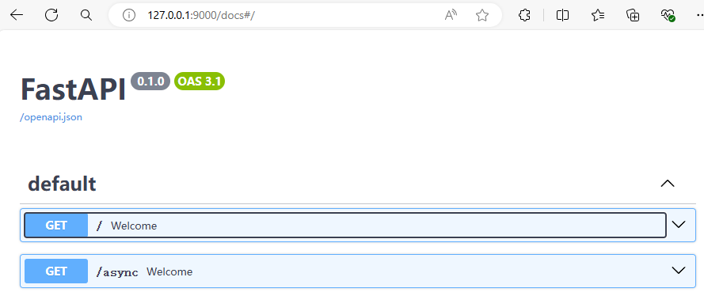

[FastAPI](https://fastapi.tiangolo.com/zh/) 
# 快速开始

FastAPI用于快速构建API的web框架。

安装fastapi库
```Bash
$ pip install fastapi
```

同时还需要一个ASGI服务器，生产环境可使用Uvicorn或Hypercorn。
```Bash
$ pip install "uvicorn[standard]"
```

基本示例

<!-- tabs:start -->
**app_fastapi.py**
```Python
from fastapi import FastAPI

app = FastAPI()


@app.get("/")
def welcome():
    return 'Hello World'


@app.get("/async")
async def welcome():
    return 'Hello World Async'
```

**启动运行**
```Bash
$ uvicorn --port 9000 app_fastapi:app
```
<!-- tabs:end -->

FasiAPI集成了Swagger UI，访问`http://127.0.0.1:9000/docs`。
 

还可以访问`http://127.0.0.1:9000/redoc`查看由ReDoc生成的文档。

基本的使用就在这里了，更详细的使用细节之后再研究官方文档。